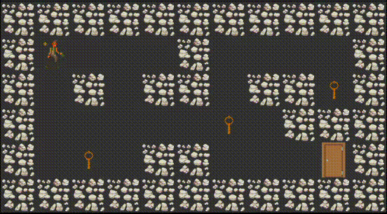

# so_long

## Overview

`So_Long` is a computer graphics project developed in the C programming language as part of the curriculum at 42 school. \
The project deals with parsing, window management, event handling, and textures. It uses the `MiniLibX` library to open windows, create images, and handle keyboard events. \
The main objective of the game is for the player to collect all the `collectibles` on the map and then escape. \
The player can move in four directions: up, down, left, and right using the `W, A, S, and D` keys, respectively. The game is displayed in a 2D view, and the current number of movements is shown in the shell at each move.

## Game Features

- The player can move in four directions using the `W, A, S, and D` keys.
- The map consists of `walls ('1')`, `collectibles ('C')`, `free spaces ('0')`, an `exit ('E')`, and the `player's starting position ('P')`.
- Players navigate through the `free spaces`, collect the `'C'` items, and ultimately reach the `'E'` tile to complete the game.
- The map must have at least `one exit`, `one collectible`, and `one starting position` to be considered valid.
- The map must be `rectangular` and `surrounded by walls`.
- The program should take a map description file as a parameter, ending with the `.ber` extension.
- The program checks for `valid paths` in the map.
- Pressing `ESC` or clicking the window's `cross` will cleanly close and quit the game.

## Building and Running the Game
To build and run the game, follow these steps:

- Clone the repository: `git clone https://github.com/ruippeixe/so_long.git`.
- Navigate to the `so_long` directory.
- Build the game by running the command: `make`.
- Once the game is built, you can run it with a map description file: `./so_long <map_file.ber>`.

## Contact
For any inquiries or feedback regarding this project, please contact [rpp@ruippeixe.com](mailto:rpp@ruippeixe.com).

Thank you for your interest!
